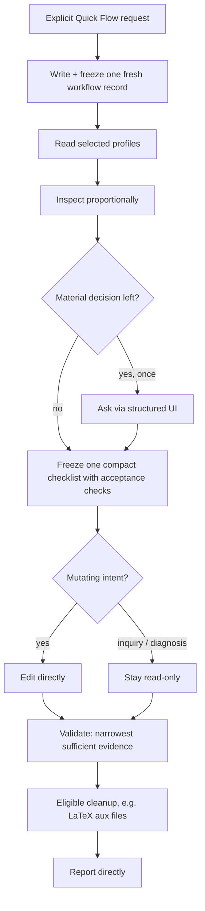

# Quick Flow

A speed-first, single-session workflow for **omp** (Oh My Pi). Quick Flow is the
lightweight counterpart to Agents Flow: the agent already serving your terminal
session does the whole job itself — no child agents, no delegation, no
background jobs. It writes and freezes a small workflow record, inspects just
enough, asks at most one question, forms a compact checklist, edits (for
mutating tasks), validates with the narrowest sufficient evidence, and reports —
all in the foreground.

- **Skill version:** `5.1.0`
- **Contract schemas:** workflow `6`, profile `4`
- **Runtime:** requires the omp coding-agent harness (it is an instruction
  contract executed by your current omp agent, not a standalone program).

---

## Table of contents

- [What it is](#what-it-is)
- [Quick Flow vs Agents Flow](#quick-flow-vs-agents-flow)
- [How it works](#how-it-works)
- [Repository contents](#repository-contents)
- [Requirements](#requirements)
- [Installation](#installation)
- [Usage](#usage)
- [Profiles](#profiles)
- [Safety model](#safety-model)
- [Updating and uninstalling](#updating-and-uninstalling)
- [Troubleshooting](#troubleshooting)
- [License](#license)

---

## What it is

Quick Flow is for bounded work that a single competent agent can finish in one
pass: a focused fix, a small feature, a document tweak, a targeted
investigation. It trades the multi-agent review machinery of Agents Flow for
speed and simplicity, while keeping the parts that matter — an explicit frozen
plan, acceptance checks tied to each change, and hard safety boundaries.

The whole run happens in your active session. There is no orchestrator/executor
split, no relay, and no reusable workflow — every invocation authors one fresh
record and runs it start to finish.

## Quick Flow vs Agents Flow

| | Quick Flow | Agents Flow |
|---|---|---|
| Topology | foreground only, one agent | separated roles (PLAN, ADVISOR, SMOL, specialists) |
| Best for | bounded, single-pass tasks | large or risky, review-worthy work |
| Delegation | none | PLAN routes review + implementation |
| Speed | fast | thorough |
| Files shipped | this skill only | skill + six agent definitions |

If a request needs parallelism, delegation, or subagents, Quick Flow will ask
you (once, up front) whether to switch to Agents Flow instead — the two are
deliberately kept separate.

## How it works



In words:

```
structure prompt -> write and freeze one fresh workflow
-> inspect -> ask once only if needed -> form one compact checklist
-> edit only for mutating intents -> validate -> eligible cleanup -> report
```

## Repository contents

```
quickflow/
├── README.md
├── install.sh                     # copies the skill into your omp config
└── skills/
    └── quickflow/                 # the skill itself (self-contained)
        ├── SKILL.md               # entry contract
        ├── CHANGELOG.md
        ├── references/            # authoring, profiles, intake, safety, templates
        └── assets/                # compact workflow template
```

Everything the skill references (`skill://quickflow/...`) lives under
`skills/quickflow/`. There are **no companion agent files** — Quick Flow spawns
nothing, so copying this one directory reproduces it exactly as it runs on the
author's machine.

## Requirements

1. **The omp (Oh My Pi) coding-agent harness.** Quick Flow is an instruction
   contract; your current omp agent executes it. It does not run outside omp.
2. That's it. Because the run is foreground-only, there are **no model-role,
   subagent, recursion-depth, or task-isolation requirements** — it uses
   whatever model your session is already on.

## Installation

### Quick install

```sh
git clone https://github.com/xzhang17/quickflow.git
cd quickflow
./install.sh
```

`install.sh` copies `skills/quickflow/` → `~/.agents/skills/quickflow/`, then
prompts you to start a fresh omp session so discovery picks it up.

Custom location:

```sh
QUICKFLOW_SKILLS_DIR="$HOME/.agents/skills" ./install.sh
```

### Manual install

```sh
# user-level (global)
cp -R skills/quickflow ~/.agents/skills/quickflow

# OR project-level (only inside one repo)
mkdir -p .agents/skills
cp -R skills/quickflow .agents/skills/quickflow
```

omp discovers user skills in `~/.agents/skills/` and project skills in
`<repo>/.agents/skills/`.

### Verify

Start omp and run:

```
/skill:quickflow
```

If the skill body loads, discovery succeeded.

## Usage

Quick Flow activates **only when you explicitly ask for it** — it never takes
over ordinary requests. Trigger it by naming it:

```
quickflow: fix the off-by-one in parse_range() and make the existing test pass
```

```
Run a quick flow to add a --dry-run flag to backup.sh and update its usage text
```

```
quickflow: investigate why plot.jl renders an empty figure — read-only, just tell me the cause
```

What happens:

1. It writes and freezes a one-shot workflow record (mutating project work goes
   under `.quickflow/`; pure inquiry/diagnosis records stay outside the project).
2. It inspects only as much as the task needs.
3. If — and only if — a genuine decision remains, it asks once through the
   structured prompt UI. Otherwise it proceeds.
4. For a mutating task it edits directly; for inquiry/diagnosis it stays
   read-only.
5. It validates with the narrowest check that proves the result, does any
   eligible cleanup, and reports.

You typically interact only when it asks its single optional question, and when
you read the final report.

## Profiles

Quick Flow selects **profiles** that define obligations for the kind of artifact
you're working on (code, LaTeX/document, UI, diagnosis, and so on). Profiles
control what "done" and "validated" mean for that task — for example, LaTeX work
must compile and gets an automatic aux-file cleanup; UI work must be exercised
in the browser. The full index and per-profile obligations live in
[`skills/quickflow/references/profiles.md`](skills/quickflow/references/profiles.md).

## Safety model

Quick Flow keeps hard boundaries even though it runs solo (see
[`references/safety.md`](skills/quickflow/references/safety.md)):

- **Inspect before editing**; touch only the files the checklist requires;
  preserve public APIs, identifiers, labels, references, and structure.
- **No destructive git** (`git reset --hard`, `git checkout -- <file>`,
  `git clean -fd`, `git stash drop`, `git restore <file>`) without your explicit
  approval in the conversation. It never discards your changes to fix its own
  work.
- **No backups are created automatically** — manage your own restore points
  (commit or stash before a large change if you want one).
- Secrets are never printed; irreversible or external actions require explicit
  authorization with a stated recovery boundary, or the run stops and asks.
- The only automatic post-success cleanup is the narrow LaTeX aux-file removal
  (`*.aux`, `*.log`, `*.out`, `*.toc`) inside the resolved build directory.

## Updating and uninstalling

**Update:**

```sh
git pull
./install.sh
```

**Uninstall:**

```sh
rm -rf ~/.agents/skills/quickflow
```

## Troubleshooting

- **`/skill:quickflow` not found** — the skill isn't in a discovered directory,
  or `skills.enabled` is off. Confirm it sits at
  `~/.agents/skills/quickflow/SKILL.md` and start a fresh session.
- **It tried to delegate / spawn agents** — that's out of scope for Quick Flow;
  it's foreground-only. Such a request should route to Agents Flow instead.
- **LaTeX aux files weren't cleaned** — cleanup runs only after every acceptance
  check passes for a mutating LaTeX task; it never runs for inquiry/diagnosis.

## License

Released under the [MIT License](LICENSE). Copyright (c) 2026 xzhang17.
