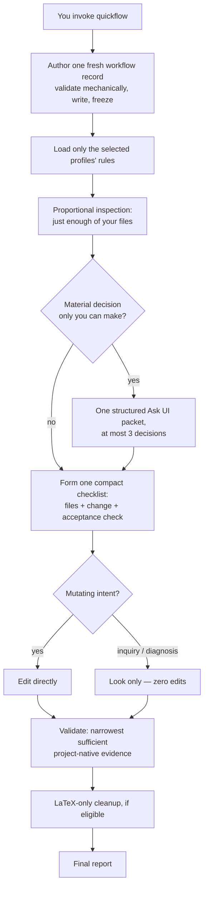

English | [简体中文](README.zh-CN.md)

# Quick Flow

A speed-first, single-session workflow skill for AI coding agents — omp (Oh My Pi), Pi agent, Codex, Claude Code, and any other AI agents.

Quick Flow makes the agent you are already talking to carry one bounded job from start to finish — plan, inspect, edit, verify, report — entirely in the foreground. It spawns no helper agents, runs nothing in the background, and hands responsibility to no one. What it keeps from heavier workflows is the discipline: a written plan frozen *before* the agent looks at your files, at most one question to you per run, an explicit acceptance check for every change, and validation before "done."

**Version** 5.2.0 · **License** MIT

Its heavyweight sibling, [Agents Flow](https://github.com/xzhang17/agentsflow), splits large or risky jobs across a reviewed multi-agent team. See [Quick Flow vs Agents Flow](#quick-flow-vs-agents-flow).

---

## Table of contents

- [Why Quick Flow](#why-quick-flow)
- [Quick Flow vs Agents Flow](#quick-flow-vs-agents-flow)
- [How a run works](#how-a-run-works)
- [The frozen workflow record](#the-frozen-workflow-record)
- [Task profiles](#task-profiles)
- [Decisions: one reply, at most](#decisions-one-reply-at-most)
- [Validation and cleanup](#validation-and-cleanup)
- [Safety guarantees](#safety-guarantees)
- [Installation](#installation)
- [Usage](#usage)
- [A worked example](#a-worked-example-tidying-latex-math)
- [Repository layout](#repository-layout)
- [Troubleshooting](#troubleshooting)
- [Versioning](#versioning)
- [License](#license)

## Why Quick Flow

For a small, well-defined job — a bug fix, a modest feature, a document tweak, a "why is this failing?" — a team of agents is overhead. But "just do it" without structure invites a different failure: the agent drifts from the request halfway through, edits things it shouldn't, or declares success without evidence.

Quick Flow is the middle path. One agent, one visible session, but bound by a contract:

1. **Plan first, frozen.** Before touching your files, the agent writes a compact workflow record — goal, allowed inputs, selected task profiles, requirements, validation expectations — validates it mechanically, and freezes it. The plan cannot drift mid-run, and every run starts from a fresh record (old ones are never reused or rewritten).
2. **Proportional everything.** It inspects only what the job needs, asks you at most one consolidated set of questions (usually none), and runs the narrowest check that actually proves the result.
3. **Read-only means read-only.** Questions and diagnoses never modify your project — not even the workflow record is stored inside it.

Everything happens live in your session; your host shows every tool call, and you can interrupt at any time.

## Quick Flow vs Agents Flow

| | Quick Flow | Agents Flow |
|---|---|---|
| Topology | one agent, entirely in your live session | coordinator + planner + reviewer + editor + specialists |
| Best for | small, bounded, well-defined jobs | multi-file, risky, or judgment-heavy jobs |
| Independent review | none — the same agent plans, edits, and validates | mandatory for scripts, risk-gated for batch edits |
| Speed | fast | slower, more thorough |
| Install | this one skill folder | skill folder + six agent definitions |

The two are deliberately kept apart: if your request also demands parallelism, delegation, or sub-agents, Quick Flow stops before authoring anything and asks (via the structured Ask UI) whether you want foreground-only Quick Flow or Agents Flow instead.

## How a run works



Step by step:

1. **Author and freeze.** From your prompt alone — before reading any target file — the agent renders the workflow template, mechanically validates it (no unfilled slots, exact version stamps, coherent profile selection), writes it to disk, and freezes it as the binding contract for the run.
2. **Inspect.** It reads just enough of the project to locate the work, resolve discoverable facts, and confirm the selected profiles actually fit what it found. A mismatch it cannot safely cover ends in a terminal safety stop, not improvisation.
3. **Ask once, if at all.** Genuine user judgments — never discoverable facts, never "approve my plan" — are consolidated into a single structured Ask UI submission of at most three decisions, each with bounded, evidence-grounded options.
4. **Checklist.** One compact internal checklist ties every change (or every answer, for read-only work) to a focused observable acceptance check. After editing begins, committed checks can be strengthened but never silently weakened.
5. **Edit — only for mutating intents.** Inquiry and diagnosis runs are strictly read-only.
6. **Validate, clean up, report.** The narrowest project-native evidence proves each committed check; eligible LaTeX work gets its bounded cleanup; and the run ends with one direct final report. There are no routine progress messages in between — the only mid-run messages you can receive are the single Ask UI packet, a safety stop, or a notice before an operation expected to exceed 90 seconds.

## The frozen workflow record

Every invocation writes exactly one new record, and its location encodes the read-only contract:

- **Mutating, project-backed work** → `.quickflow/QUICK_WORKFLOW.md` inside your project (collision-free suffixes like `QUICK_WORKFLOW_<task-slug>.md` when needed).
- **Inquiry, diagnosis, or no writable project root** → a project-external session location (`local://quickflow/workflows/...`), so asking a question never dirties your repository.

Each record carries exact stamps — `Quick Flow skill: 5.2.0`, `Workflow schema: 6`, `Profile schema: 4` — and separates what you said (requirements) from what must be discovered by inspection ("Facts for QUICK to discover"). Records are immutable snapshots: never overwritten, never reused as input for a later run, never migrated across versions. Later bounded decisions are recorded in the final report, not by editing the record.

## Task profiles

For each kind of work, Quick Flow follows a composable rulebook, called a *profile* (full definitions in [`skills/quickflow/references/profiles.md`](skills/quickflow/references/profiles.md)). Profiles come in four groups:

- **Intent** — what you asked for: inquiry, diagnosis, repair, feature implementation, refactor, optimization, translation, formatting, conversion. Exactly one is primary; the read-only intents (inquiry, diagnosis) never mix with mutating ones.
- **Artifact** — what is being touched: code, web UI, configuration/data, LaTeX documents, generic documents, generic files.
- **Evidence** — optional overlays defining proof: build/test, visual/browser/PDF, source-reference.
- **Fallback** — `generic-fallback`, when no artifact profile clearly applies; first inspection resolves it into exactly one specific artifact profile.

Profiles decide what "finished" and "properly checked" mean: a LaTeX change must compile with the project's native pipeline, a web-page change must be exercised in a real browser, a refactor must demonstrably preserve behavior at its interfaces. The profile set selected at authoring time is frozen with the record; the agent may mark an obligation inapplicable only before editing, only with observed evidence, and must disclose it in the final report.

## Decisions: one reply, at most

A run waits for at most **one** user reply, through one of two mutually exclusive channels:

- one structured Ask UI submission with up to three evidence-grounded decisions (bounded options, recommendation included), or
- one resumable safety stop, when something genuinely blocks continuation.

Zero questions is the preferred and common case. The agent never asks about discoverable facts, implementation preferences, or checklist approval. A newly discovered non-destructive target clearly implied by your original request may be added and disclosed in the report; genuine scope expansion triggers the safety-stop rules instead of silent growth.

## Validation and cleanup

Validation is proportional: semantically equivalent obligations across profiles collapse into a single check, and the narrowest project-native evidence that proves the result is the one that runs. Repairs are re-reproduced when practical; changed UI is exercised in the browser; task-relevant LaTeX is compiled with focused page and diagnostic inspection. Exhaustive comparisons, full test suites, formatters, and linters run only when the prompt or the changed interface requires them. A committed check that cannot run is reported failed or blocked — never dropped, and never "fixed" by editing unrelated source until it passes.

The only automatic cleanup is deliberately narrow: after every committed check passes for a *mutating* LaTeX job, the agent resolves the actual build directory and removes, non-recursively, the regular files directly in it whose extension is a known LaTeX intermediate (`.aux`, `.bbl`, `.bcf`, `.blg`, `.fls`, `.fdb_latexmk`, `.log`, `.out`, `.run.xml`, `.synctex.gz`, `.toc`, and the rest of the generated set). It never removes `.pdf`, source, figure, or asset files, never recurses, and never runs for inquiry or diagnosis. Cleanup failure is a non-fatal warning, not a failed run.

## Safety guarantees

Firm rules, canonical in [`skills/quickflow/references/safety.md`](skills/quickflow/references/safety.md):

- Inspect before editing; fix the requested problem at its source; touch only checklist-required files; preserve protected names, labels, cross-references, paths, structure, and meaning.
- Destructive git rollback commands require your explicit approval in the current conversation, and your changes are never discarded to cover the workflow's own mistakes.
- Irreversible or externally visible effects (permanent deletion, publishing, sending) require exact authorization plus recovery and validation boundaries.
- Secrets and credentials are never printed.
- Corruption is repaired only when it is the explicitly named target; unexpected corruption or suspected data loss ends in a terminal safety stop, not a guess.
- No automatic backups. Want a safety net before a big change? Commit or stash first.
- A recovery packet (audit evidence outside your project) is persisted only when you request one, an irreversible effect occurred or was attempted, or a run fails after modifying files. Otherwise evidence is reported inline, and nothing extra is left behind.

## Installation

### Prerequisite

Any coding agent would work. Quick Flow is a host-agnostic instruction contract, not a standalone program — it needs only an agent that reads, edits, and runs commands and can ask you a question, all in one foreground session. It requires no sub-agent spawning, background jobs, or delegation, so plain agents qualify: omp (Oh My Pi), Pi agent, Codex, Claude Code, and similar. Everything runs in your existing session using whatever model that session already uses — no extra agents, models, or settings.

### Install

```sh
git clone https://github.com/xzhang17/quickflow.git
cd quickflow
./install.sh
```

This copies the skill to `~/.agents/skills/quickflow/` — the shared skills directory that agents like omp, Pi agent, codex, and Claude Code discover. Start a new session so skill discovery picks it up.

### Manual install

```sh
# globally
cp -R skills/quickflow ~/.agents/skills/quickflow

# or per-project
mkdir -p .agents/skills
cp -R skills/quickflow .agents/skills/quickflow
```

### Verify

In a new session, invoking the skill (for example `/skill:quickflow` in omp, Pi agent, Codex, Claude Code, or an equivalent slash command in agents that expose skills that way) should load the instructions. In an agent without skill auto-discovery, point it at `skills/quickflow/SKILL.md` directly.

## Usage

Quick Flow activates only when you name it — it never takes over ordinary requests, and activation does not carry across turns:

```
quickflow: fix the off-by-one in parse_range() and make sure the existing test passes
```

```
Run a quick flow to add a --dry-run option to backup.sh and update its help text
```

```
quickflow: figure out why plot.jl produces an empty figure — don't change anything, just report the cause
```

You typically interact twice: once if the single Ask UI packet appears, and once to read the final report.

## A worked example: tidying LaTeX math

A physics book (a main file plus eleven chapters) was full of spurious spaces inside math — `\vec {B} \approx B (z) \hat {z}` where the author wanted `\vec{B}\approx B(z)\hat{z}`:

```
quickflow: the math is full of unnecessary spaces like `\vec {B} \approx B (z) \hat {z}`.
Clean them up across main.tex and all 11 chapters — but the printed output must stay identical.
```

What the run did, and why each step matters:

1. **Froze the contract**: the goal, the exact twelve editable files, and the binding invariant — remove only spaces TeX ignores, so the rendered output cannot change.
2. **Inspected for traps before editing**: a space after a control word (`\approx B`) is required; spaces inside `\text{...}` are content; `\quad` and `\,` are deliberate; and the book hid prose inside math environments — so blind find-and-replace would have corrupted it.
3. **Edited within the invariant**, preserving required spaces, deliberate spacing commands, and each equation's indentation.
4. **Proved it**: compiled the PDF before and after and compared — identical text over 254 pages, no new warnings, no broken cross-references. ~15,700 spurious spaces removed across twelve files.
5. **Cleaned up and reported**: removed the generated LaTeX intermediates (`.aux`, `.bbl`, `.log`, `.out`, `.toc`, and the rest of the known set — never `.pdf`) from the build directory and stated exactly what changed.

The pattern is the point, not the LaTeX: a frozen plan, inspection before mutation, edits inside a stated invariant, and a concrete before/after proof preceding "done."

## Repository layout

```
quickflow/
├── README.md
├── README.zh-CN.md
├── LICENSE
├── install.sh                  # copies the skill into the shared skills dir
└── skills/quickflow/
    ├── SKILL.md                # the core contract (always loaded on activation)
    ├── CHANGELOG.md
    ├── assets/
    │   └── QUICK_WORKFLOW_CORE.template.md    # workflow record template
    └── references/             # loaded per phase, not all at once
        ├── workflow-authoring.md   # rendering, mechanical validation, freeze
        ├── profiles.md             # 19 task profiles + composition contract
        ├── grilling-intake.md      # structured-decision and safety-stop rules
        ├── safety.md               # scope, secrets, rollback, recovery boundaries
        └── templates.md            # safety-stop, notice, and report formats
```

Everything Quick Flow needs is in `skills/quickflow/` — there are no agent definitions, because there are no other agents.

## Troubleshooting

| Symptom | Likely cause and fix |
|---|---|
| `/skill:quickflow` not found | Skill not at `~/.agents/skills/quickflow/SKILL.md`, or skills disabled. Re-run `install.sh`, start a new session. |
| It asked to switch to Agents Flow | Your request implied delegation or parallelism, which Quick Flow deliberately refuses. Either simplify the request or use [Agents Flow](https://github.com/xzhang17/agentsflow). |
| A `.quickflow/` folder appeared in your project | That is the frozen workflow record for a mutating run — a plain-text audit trail, safe to read, commit, or delete. |
| LaTeX temp files weren't cleaned | Cleanup runs only after a *mutating* LaTeX job passes every committed check; never for inquiry/diagnosis, and never outside the resolved build directory. |

## Versioning

The skill carries a semantic version (currently **5.2.0**) plus independent schema numbers for the workflow record format (`6`) and profile format (`4`); schema numbers change only when those file formats change, so old records remain readable as historical snapshots (they are never executed again). Full history: [`skills/quickflow/CHANGELOG.md`](skills/quickflow/CHANGELOG.md).

## License

[MIT](LICENSE). Copyright (c) 2026 xzhang17.
