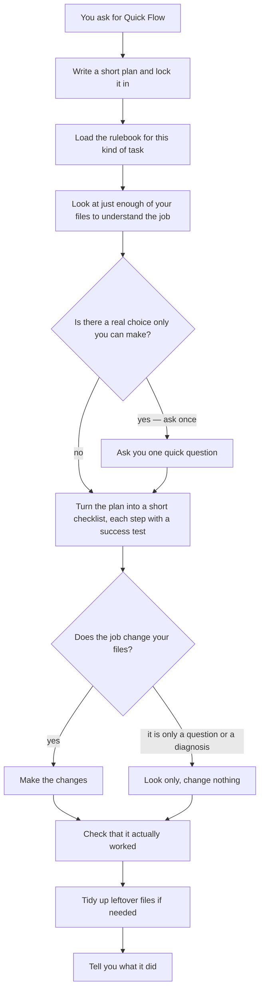

# Quick Flow

Quick Flow is a helper mode for **omp** (Oh My Pi), an AI coding assistant that
works in your terminal. It lets the assistant take one small, clearly-defined
job and carry it out from start to finish in a single go — right in the chat
you're already in, without calling in extra assistants and without running
anything hidden in the background.

Think of it as the assistant's "just do this one thing, carefully and quickly"
mode. It writes a short plan, looks at only what it needs to, asks you a question
only if it genuinely has to, makes the change (when the job is to change
something), confirms the result actually works, and tells you what it did.

- **Version:** 5.1.0
- **What you need:** the omp assistant. Quick Flow is a set of instructions omp
  follows — not a separate program you install and run on its own.

---

## Table of contents

- [What it is](#what-it-is)
- [Quick Flow vs Agents Flow](#quick-flow-vs-agents-flow)
- [How it works](#how-it-works)
- [Repository contents](#repository-contents)
- [What you need](#what-you-need)
- [Installation](#installation)
- [How to use it](#how-to-use-it)
- [Task rulebooks (profiles)](#task-rulebooks-profiles)
- [Safety](#safety)
- [Updating and removing](#updating-and-removing)
- [If something goes wrong](#if-something-goes-wrong)
- [License](#license)

---

## What it is

Quick Flow is meant for small, well-defined jobs the assistant can finish in one
pass — a quick bug fix, a small new feature, a tweak to a document, or a question
like "why isn't this working?".

It's the simple, fast option. Its bigger sibling, **Agents Flow**, splits large
or risky jobs across a team of specialized assistants that check each other's
work. Quick Flow skips all that teamwork and does everything itself — but it
still keeps the habits that matter: it writes down a clear plan and locks it in
before starting, it says exactly what "success" means for each step, and it never
touches things it shouldn't.

Everything happens live in your current session. No part of the work is handed
off to other assistants, nothing runs out of sight in the background, and every
time you use it, it starts over with a fresh plan.

## Quick Flow vs Agents Flow

| | Quick Flow | Agents Flow |
|---|---|---|
| How it works | one assistant, all in your live session | a team of specialized assistants (a planner, a reviewer, an editor, and more) |
| Best for | small, well-defined jobs | large or risky jobs that deserve extra review |
| Brings in other assistants? | no | yes |
| Speed | fast | more thorough |
| What you download | just this skill | the skill plus six assistant definitions |

If a job genuinely needs several assistants working at once, Quick Flow will
pause and ask whether you'd rather switch to Agents Flow — the two are kept
separate on purpose.

## How it works



In plain steps:

1. Write a short plan and lock it in so it can't drift halfway through.
2. Look at just enough of your files to understand the job.
3. Ask you one question only if there's a real decision it can't make for you.
4. Turn the plan into a short checklist, where each step has a clear test of
   success.
5. Make the changes — but only if the job is to change something. If it's just a
   question or a diagnosis, it looks without changing anything.
6. Confirm the result works, tidy up, and report back.

## Repository contents

```
quickflow/
├── README.md
├── install.sh          # copies the skill into omp so it can find it
└── skills/
    └── quickflow/      # the skill itself
        ├── SKILL.md    # the main instructions
        ├── CHANGELOG.md
        ├── references/ # the detailed rulebooks
        └── assets/     # a plan template
```

Everything Quick Flow needs is inside `skills/quickflow/`. There are no extra
assistant files to worry about — Quick Flow does the whole job itself, so copying
this one folder gives you exactly what runs on the author's computer.

## What you need

1. **The omp (Oh My Pi) assistant.** Quick Flow is a set of instructions omp
   follows; it does not run on its own.
2. Nothing else. Because everything happens in your one live session, there are
   no extra settings, AI models, or helper assistants to set up — it simply uses
   whatever AI model your omp session is already using.

## Installation

### The easy way

```sh
git clone https://github.com/xzhang17/quickflow.git
cd quickflow
./install.sh
```

This copies the skill into the folder where omp looks for its skills
(`~/.agents/skills/quickflow/`). When it finishes, start a new omp session so it
notices the new skill.

New to these commands? `git clone` downloads the files, `cd` moves into the
downloaded folder, and `./install.sh` runs the copy step. You'll need
[Git](https://git-scm.com) installed.

### By hand

If you'd rather copy the files yourself:

```sh
# make it available everywhere
cp -R skills/quickflow ~/.agents/skills/quickflow

# or only inside one project folder
mkdir -p .agents/skills
cp -R skills/quickflow .agents/skills/quickflow
```

omp looks for your skills in `~/.agents/skills/`, and for a single project in
that project's own `.agents/skills/` folder.

### Check it worked

Start omp and type:

```
/skill:quickflow
```

If the instructions load, it's installed.

## How to use it

Quick Flow only starts when you ask for it by name — it won't take over your
normal requests. Just mention it:

```
quickflow: fix the counting error in parse_range() and make sure the existing test passes
```

```
Run a quick flow to add a "preview only" option to backup.sh and update its help text
```

```
quickflow: figure out why plot.jl shows an empty figure — don't change anything, just tell me the cause
```

What it does behind the scenes:

1. Writes down a short, one-time plan. Plans for jobs that change files are saved
   in a `.quickflow/` folder inside your project; plans for pure questions are
   kept outside your project.
2. Looks at only as much of your files as the job needs.
3. Asks you one question only if there's a real decision it can't make for you.
   Otherwise it just proceeds.
4. If the job is to change files, it makes the changes. If it's just a question
   or a diagnosis, it looks without changing anything.
5. Runs the simplest check that proves the result works, tidies up, and reports
   back.

Most of the time you'll only step in to answer that one optional question and to
read the final summary.

## Task rulebooks (profiles)

For each kind of work — computer code, LaTeX or other documents, web pages, or
troubleshooting — Quick Flow follows a built-in rulebook. (In the files these are
called "profiles.") The rulebook decides what counts as "finished" and "properly
checked" for that kind of task. For example, a LaTeX document must build
successfully and gets its temporary files cleaned up afterward, and a web-page
change must be opened and tried in a real browser. The full set of rulebooks is
in [`skills/quickflow/references/profiles.md`](skills/quickflow/references/profiles.md).

## Safety

Even though Quick Flow works alone, it sticks to firm rules (details in
[`references/safety.md`](skills/quickflow/references/safety.md)):

- It looks before it edits, changes only the files the job needs, and leaves
  names, labels, cross-references, and document structure intact.
- It will not run commands that could throw away your work (certain Git "undo"
  commands) without asking you first — and it never discards your changes to
  cover up its own mistake.
- It does not make backups for you. If you want a safety net before a big change,
  save your own restore point first (for example, commit or stash in Git).
- It never prints passwords or secret keys. Anything permanent or that reaches
  the outside world — deleting things for good, publishing, sending messages —
  needs your clear go-ahead, or it stops and asks.
- The only cleanup it does on its own is removing the harmless temporary files
  that LaTeX leaves behind after a successful build.

## Updating and removing

**Update:**

```sh
git pull
./install.sh
```

**Remove:**

```sh
rm -rf ~/.agents/skills/quickflow
```

## If something goes wrong

- **`/skill:quickflow` isn't found** — the files aren't where omp looks, or
  skills are turned off. Make sure the skill sits at
  `~/.agents/skills/quickflow/SKILL.md`, then start a new session.
- **It tried to bring in other assistants** — that's not what Quick Flow does; it
  works alone. A job like that belongs to Agents Flow instead.
- **LaTeX temporary files weren't cleaned up** — that cleanup only happens after a
  file-changing LaTeX job fully succeeds; it never runs for a plain question or
  diagnosis.

## License

Released under the [MIT License](LICENSE). Copyright (c) 2026 xzhang17.
