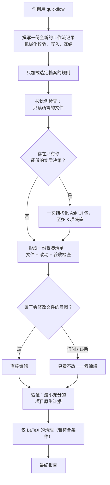

[English](README.md) | 简体中文

# Quick Flow

一个速度优先、单会话的工作流技能，面向各类 AI 编程智能体——omp（Oh My Pi）、Pi agent、Codex、Claude Code，以及任何其他 AI 智能体。

Quick Flow 让你正在对话的这个智能体，把一件边界清晰的任务从头到尾在前台完成——规划、检查、编辑、验证、汇报。它不派生任何辅助智能体，不在后台运行任何东西，也不把责任移交给任何人。它从更重型的工作流中保留下来的是纪律：在智能体查看你的文件*之前*就冻结的书面计划、每次运行最多向你提一次问题、每处改动都有明确的验收检查，以及在宣布"完成"之前先做验证。

**版本** 5.2.0 · **许可证** MIT

它的重型姊妹项目 [Agents Flow](https://github.com/xzhang17/agentsflow) 会把大型或高风险任务拆分给一个带独立评审的多智能体团队。参见 [Quick Flow 与 Agents Flow 对比](#quick-flow-与-agents-flow-对比)。

---

## 目录

- [为什么需要 Quick Flow](#为什么需要-quick-flow)
- [Quick Flow 与 Agents Flow 对比](#quick-flow-与-agents-flow-对比)
- [一次运行的流程](#一次运行的流程)
- [冻结的工作流记录](#冻结的工作流记录)
- [任务档案](#任务档案)
- [决策：最多一次回复](#决策最多一次回复)
- [验证与清理](#验证与清理)
- [安全保证](#安全保证)
- [安装](#安装)
- [使用方法](#使用方法)
- [实例：清理 LaTeX 数学公式](#实例清理-latex-数学公式)
- [仓库结构](#仓库结构)
- [故障排查](#故障排查)
- [版本机制](#版本机制)
- [许可证](#许可证)

## 为什么需要 Quick Flow

对于一件小而明确的工作——修一个 bug、加一个不大的功能、改一处文档、查一个"为什么会失败？"——动用一个智能体团队是不必要的开销。但毫无结构的"直接干"会引来另一种失败：智能体干到一半偏离了请求、改了不该改的东西，或者没有任何证据就宣布成功。

Quick Flow 是中间道路。一个智能体、一个可见的会话，但受契约约束：

1. **先规划，且冻结。** 在触碰你的文件之前，智能体先写出一份紧凑的工作流记录——目标、允许的输入、选定的任务档案、需求、验证预期——机械化地校验后将其冻结。计划不会在运行途中漂移，并且每次运行都从一份全新记录开始（旧记录绝不复用或改写）。
2. **一切按比例。** 它只检查任务所需的内容，最多向你提一组合并后的问题（通常一个都不问），并且只运行真正能证明结果的最小检查。
3. **只读就是只读。** 提问和诊断绝不修改你的项目——连工作流记录都不会存放在项目内。

一切都在你的会话中实时进行；宿主环境会显示每一次工具调用，你随时可以打断。

## Quick Flow 与 Agents Flow 对比

| | Quick Flow | Agents Flow |
|---|---|---|
| 拓扑结构 | 单个智能体，完全在你的实时会话中 | 协调者 + 规划者 + 评审者 + 编辑者 + 专家 |
| 适用场景 | 小型、边界清晰、定义明确的任务 | 跨多文件、高风险或需要大量判断的任务 |
| 独立评审 | 无——同一个智能体负责规划、编辑和验证 | 脚本必须评审，批量编辑按风险决定 |
| 速度 | 快 | 更慢、更彻底 |
| 安装 | 仅这一个技能文件夹 | 技能文件夹 + 六个智能体定义 |

二者被刻意分开：如果你的请求还需要并行、委派或子智能体，Quick Flow 会在撰写任何内容之前停下，并（通过结构化 Ask UI）询问你要继续使用纯前台的 Quick Flow，还是改用 Agents Flow。

## 一次运行的流程



逐步说明：

1. **撰写并冻结。** 仅凭你的提示——在读取任何目标文件之前——智能体渲染工作流模板，机械化校验（无未填充的槽位、精确的版本戳、连贯的档案选择），写入磁盘，并将其冻结为本次运行的约束性契约。
2. **检查。** 它只读取项目中定位工作所需的部分，解决可发现的事实，并确认所选档案确实符合实际情况。遇到无法安全覆盖的不匹配时，以终止性的安全停止收场，而不是即兴发挥。
3. **至多问一次。** 真正需要用户判断的问题——绝不是可发现的事实，也绝不是"批准我的计划"——会被合并进一次结构化 Ask UI 提交，至多 3 项决策，每项都附有边界明确、有证据支撑的选项。
4. **清单。** 一份紧凑的内部清单把每处改动（对只读工作则是每个答案）与一项聚焦、可观察的验收检查绑定。编辑开始后，已承诺的检查只能加强，绝不能被悄悄削弱。
5. **编辑——仅限会修改文件的意图。** 询问和诊断类运行严格只读。
6. **验证、清理、汇报。** 用最小的项目原生证据证明每项已承诺的检查；符合条件的 LaTeX 工作执行其限定范围的清理；运行以一份直接的最终报告结束。中间没有例行的进度消息——你可能收到的运行中消息只有三种：那一次 Ask UI 包、一次安全停止，或某项操作预计超过 90 秒时的预告。

## 冻结的工作流记录

每次调用都恰好写入一份新记录，其存放位置本身就体现了只读契约：

- **会修改文件、有项目依托的工作** → 项目内的 `.quickflow/QUICK_WORKFLOW.md`（需要时使用免冲突后缀，如 `QUICK_WORKFLOW_<task-slug>.md`）。
- **询问、诊断，或没有可写的项目根目录** → 项目之外的会话位置（`local://quickflow/workflows/...`），因此提一个问题绝不会弄脏你的仓库。

每份记录都带有精确的版本戳——`Quick Flow skill: 5.2.0`、`Workflow schema: 6`、`Profile schema: 4`——并把你说的内容（需求）与必须通过检查发现的内容（"留待 QUICK 发现的事实"）分开。记录是不可变的快照：绝不被覆盖，绝不作为后续运行的输入被复用，绝不跨版本迁移。后续的有界决策记录在最终报告中，而不是通过修改记录。

## 任务档案

对每一类工作，Quick Flow 遵循一套可组合的规则手册，称为*档案*（profile，完整定义见 [`skills/quickflow/references/profiles.md`](skills/quickflow/references/profiles.md)）。档案分为四组：

- **意图（Intent）**——你要求做什么：询问、诊断、修复、功能实现、重构、优化、翻译、格式化、转换。有且仅有一个主意图；只读意图（询问、诊断）绝不与会修改文件的意图混用。
- **工件（Artifact）**——被触碰的对象：代码、Web UI、配置/数据、LaTeX 文档、通用文档、通用文件。
- **证据（Evidence）**——定义证明方式的可选叠加层：构建/测试、视觉/浏览器/PDF、来源引用。
- **兜底（Fallback）**——`generic-fallback`，仅在没有工件档案明显适用时使用；首次检查会把它解析为恰好一个具体的工件档案。

档案决定"完成"和"检查到位"的含义：LaTeX 改动必须用项目的原生流水线编译通过，网页改动必须在真实浏览器中实际操作过，重构必须在其接口层面可证明地保持行为不变。撰写时选定的档案集随记录一起冻结；智能体只能在编辑开始前、且有观察到的证据时，把某项义务标记为不适用，并且必须在最终报告中披露。

## 决策：最多一次回复

一次运行至多等待**一次**用户回复，通过两个互斥的渠道之一：

- 一次结构化 Ask UI 提交，至多包含三项有证据支撑的决策（选项有界、附推荐意见）；或
- 一次可恢复的安全停止，当确有事项阻断继续时。

零提问是首选也是常态。智能体绝不询问可发现的事实、实现偏好或清单批准。如果新发现某个非破坏性目标明显在你原始请求的含义之内，可以加入并在报告中披露；真正的范围扩张则触发安全停止规则，而不是悄悄扩大。

## 验证与清理

验证是按比例的：跨档案语义等价的义务合并为一项检查，只运行能证明结果的最小项目原生证据。修复在可行时会先复现再证明消失；改动过的 UI 在浏览器中实际操作；与任务相关的 LaTeX 用聚焦的页面与诊断检查进行编译。穷举式对比、完整测试套件、格式化工具和 linter 只在提示或被改动的接口确有要求时才运行。无法运行的已承诺检查会被报告为失败或受阻——绝不丢弃，也绝不通过修改无关源码"修"到它通过为止。

唯一的自动清理刻意保持狭窄：在一次*会修改文件*的 LaTeX 任务的所有已承诺检查全部通过后，智能体解析实际的构建目录，并不递归地删除该目录下扩展名属于已知 LaTeX 中间文件的常规文件（`.aux`、`.bbl`、`.bcf`、`.blg`、`.fls`、`.fdb_latexmk`、`.log`、`.out`、`.run.xml`、`.synctex.gz`、`.toc` 以及其余生成集）。它绝不删除 `.pdf`、源文件、图片或资源文件，绝不递归，也绝不在询问或诊断运行中执行。清理失败只是非致命警告，不算运行失败。

## 安全保证

硬性规则，权威版本见 [`skills/quickflow/references/safety.md`](skills/quickflow/references/safety.md)：

- 先检查再编辑；在源头修复被请求的问题；只触碰清单要求的文件；保护性名称、标签、交叉引用、路径、结构和语义一律保留。
- 破坏性的 git 回滚命令需要你在当前对话中明确批准，且绝不通过丢弃你的改动来掩盖工作流自身的失误。
- 不可逆或对外可见的效果（永久删除、发布、发送）需要精确授权，外加恢复与验证边界。
- 密钥与凭据绝不打印。
- 只有当损坏本身就是被明确指名的目标时才修复它；意外损坏或疑似数据丢失以终止性安全停止收场，而不是靠猜。
- 没有自动备份。想在大改动前留个后路？先 commit 或 stash。
- 恢复包（存放在项目之外的审计证据）只在三种情况下持久化：你主动要求、发生或尝试了不可逆效果、或运行在修改文件后失败。其余情况下证据在报告中内联给出，不留任何额外文件。

## 安装

### 前置条件

任意编程智能体即可。 Quick Flow 是一份与宿主无关的指令契约，而非独立程序——它只需要一个能读取、编辑、运行命令并能向你提问的智能体，且一切都在单个前台会话中完成。它不需要派生子智能体、后台任务或委派，因此普通智能体即可胜任：omp（Oh My Pi）、Claude Code、Codex 等。一切都在你现有的会话中运行，使用该会话当前使用的任何模型——没有额外的智能体、模型或设置。

### 安装

```sh
git clone https://github.com/xzhang17/quickflow.git
cd quickflow
./install.sh
```

这会把技能复制到 `~/.agents/skills/quickflow/`——即 omp、Pi agent、codex、Claude Code 等智能体共同发现技能的目录。然后开启一个新的会话，让技能发现机制加载它。

### 手动安装

```sh
# 全局
cp -R skills/quickflow ~/.agents/skills/quickflow

# 或按项目
mkdir -p .agents/skills
cp -R skills/quickflow .agents/skills/quickflow
```

### 验证

在新的会话中，调用该技能（例如在 omp、Pi agent、Codex、Claude Code 中用 `/skill:quickflow`，或在以斜杠命令暴露技能的智能体中用等价命令）应能加载指令。若智能体不支持技能自动发现，直接让它读取 `skills/quickflow/SKILL.md` 即可。

## 使用方法

Quick Flow 只在你点名时激活——它绝不接管普通请求，且激活不跨轮次延续：

```
quickflow: fix the off-by-one in parse_range() and make sure the existing test passes
```

```
Run a quick flow to add a --dry-run option to backup.sh and update its help text
```

```
quickflow: figure out why plot.jl produces an empty figure — don't change anything, just report the cause
```

你通常只交互两次：如果出现那一次 Ask UI 包时回复一次，以及阅读最终报告一次。

## 实例：清理 LaTeX 数学公式

一本物理书（一个主文件加十一章）的数学公式里满是多余空格——写成了 `\vec {B} \approx B (z) \hat {z}`，而作者想要的是 `\vec{B}\approx B(z)\hat{z}`：

```
quickflow: the math is full of unnecessary spaces like `\vec {B} \approx B (z) \hat {z}`.
Clean them up across main.tex and all 11 chapters — but the printed output must stay identical.
```

这次运行做了什么，以及每一步为何重要：

1. **冻结契约**：目标、恰好十二个可编辑文件，以及约束性不变量——只删除 TeX 会忽略的空格，确保渲染输出不可能改变。
2. **编辑前先排查陷阱**：控制词后的空格（`\approx B`）是必需的；`\text{...}` 内的空格是内容；`\quad` 和 `\,` 是有意为之；而且这本书把散文藏在了数学环境里——盲目的查找替换会把它毁掉。
3. **在不变量之内编辑**，保留必需的空格、有意的间距命令，以及每个公式的缩进。
4. **拿出证明**：编译改动前后的 PDF 并逐一对比——254 页文本完全一致，没有新增警告，没有失效的交叉引用。十二个文件共移除约 15,700 处多余空格。
5. **清理并汇报**：删除构建目录下生成的 LaTeX 中间文件（`.aux`、`.bbl`、`.log`、`.out`、`.toc` 等已知集合，绝不含 `.pdf`），并准确说明改了什么。

重点在于模式，不在于 LaTeX：冻结的计划、修改前的检查、在声明的不变量之内编辑，以及在说"完成"之前拿出具体的前后对比证明。

## 仓库结构

```
quickflow/
├── README.md
├── README.zh-CN.md
├── LICENSE
├── install.sh                  # 把技能复制进共享技能目录
└── skills/quickflow/
    ├── SKILL.md                # 核心契约（激活时始终加载）
    ├── CHANGELOG.md
    ├── assets/
    │   └── QUICK_WORKFLOW_CORE.template.md    # 工作流记录模板
    └── references/             # 按阶段加载，而非一次全部
        ├── workflow-authoring.md   # 渲染、机械化校验、冻结
        ├── profiles.md             # 19 个任务档案 + 组合契约
        ├── grilling-intake.md      # 结构化决策与安全停止规则
        ├── safety.md               # 范围、密钥、回滚、恢复边界
        └── templates.md            # 安全停止、通知与报告格式
```

Quick Flow 需要的一切都在 `skills/quickflow/` 里——没有智能体定义文件，因为根本没有其他智能体。

## 故障排查

| 症状 | 可能原因与解决办法 |
|---|---|
| 找不到 `/skill:quickflow` | 技能不在 `~/.agents/skills/quickflow/SKILL.md`，或技能功能被禁用。重新运行 `install.sh`，开启新会话。 |
| 它要求切换到 Agents Flow | 你的请求隐含了委派或并行，而 Quick Flow 刻意拒绝这些。要么简化请求，要么改用 [Agents Flow](https://github.com/xzhang17/agentsflow)。 |
| 项目里出现了 `.quickflow/` 文件夹 | 那是某次会修改文件的运行留下的冻结工作流记录——纯文本审计记录，可放心阅读、提交或删除。 |
| LaTeX 临时文件没被清理 | 清理只在一次*会修改文件*的 LaTeX 任务通过全部已承诺检查后运行；询问/诊断运行绝不清理，也绝不超出解析出的构建目录。 |

## 版本机制

技能带有一个语义化版本（当前为 **5.2.0**），外加相互独立的模式号：工作流记录格式（`6`）和档案格式（`4`）；模式号只在这些文件格式变化时才改变，因此旧记录始终可作为历史快照读取（它们绝不会被再次执行）。完整历史见 [`skills/quickflow/CHANGELOG.md`](skills/quickflow/CHANGELOG.md)。

## 许可证

[MIT](LICENSE)。Copyright (c) 2026 xzhang17。
